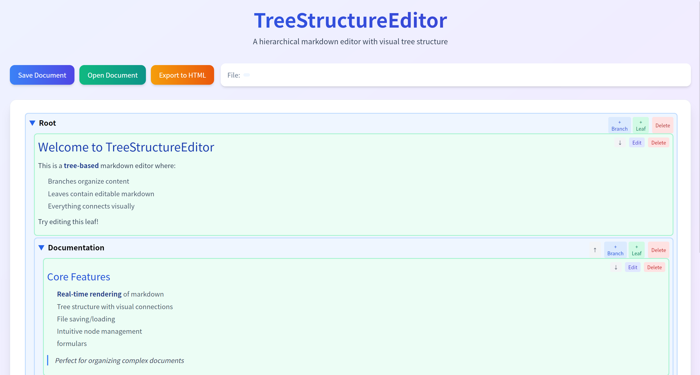

# TreeStructureEditor

这是一个处理树状文本文件的编辑器

项目始建与2023年，本人高三那年

目的是协助整理知识结构

使用**tauri**重构

## 功能

- 树状结构
    - 枝干节点
    - 叶子节点
    - 节点展开收起
    - 节点上下移动
    - 节点删除
    - 节点添加
    - 节点编辑
- 文件
    - 打开文件
    - 保存文件
    - 导出为html
- 编辑
    - markdown
    - latex公式

## 使用方法

win: 下载压缩包，解压后直接运行可执行文件

linux/android: 下载安装包，安装后运行

dev: 克隆项目，安装tauri-cli，运行`cargo-tauri dev`命令
